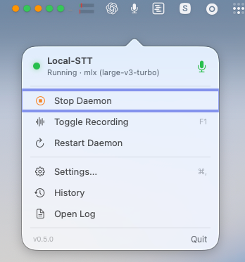
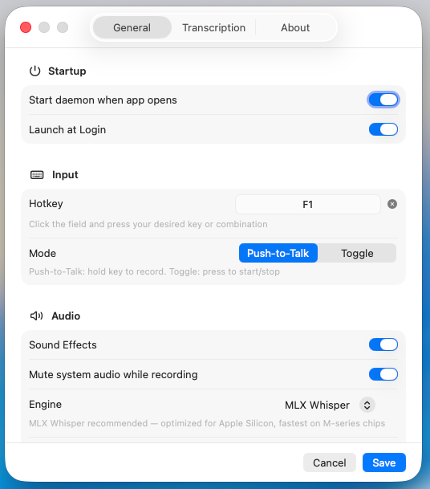

# Local-STT

Free, local, private speech-to-text for your Mac. No cloud, no API costs, no data leaves your device.


-blue.svg)


> Press your hotkey, speak — text appears at your cursor. Works in any app.

<p align="center">
  
</p>
<p align="center">
  
</p>

---

## Features

| | Feature | Details |
|---|---------|---------|
| 🎙️ | **Native Menu Bar App** | Always-on macOS status bar control with popover UI |
| 🔒 | **100% Local** | MLX Whisper runs on Apple Silicon GPU — no cloud, no API keys |
| ⚡ | **Fast** | ~2-3s transcription (medium model) on M-series chips |
| 🇩🇪 | **14 Languages** | German, English, French, Spanish, and 10 more |
| ⌨️ | **Push-to-Talk** | Hold any configurable hotkey, speak, release (or use toggle mode) |
| 🎛️ | **Settings UI** | Native SwiftUI settings with hotkey recorder, engine picker, vocabulary editor |
| 🔊 | **Sound Feedback** | Audio cues for recording start/stop |
| 📝 | **Custom Vocabulary** | Add domain-specific terms to improve recognition accuracy |
| 🔍 | **Transcript History** | Searchable history with inline word correction and clipboard copy |

---

## Download & Install

Run this in Terminal:

```bash
curl -fsSL https://raw.githubusercontent.com/Advisior/local-stt/main/install.sh | bash
```

This sets up a self-contained Python environment under `~/Library/Application Support/Local-STT/`, builds the menu bar app from source, and installs it to `/Applications`. It needs the Xcode Command Line Tools (`xcode-select --install` if you don't have them) and works with or without Homebrew/`uv` already installed — the script tells you what's missing if anything is.

**macOS 27:** the SDK that ships with the Command Line Tools can no longer build the menu bar app (SwiftUI's `@State` became a macro whose compiler plugin comes only with Xcode). Install Xcode before running the script, see [#35](https://github.com/Advisior/local-stt/issues/35).

**Note:** On first launch, macOS will show "app from an unidentified developer" (this build is ad-hoc signed, not notarized). Right-click the app in `/Applications` > Open > Open to bypass Gatekeeper once.

A plain zip download of the app alone will not work — see [Development](#development) below for why, and for the manual build path if you'd rather not pipe a script into `bash`.

---

## Getting Started

1. **Launch** Local-STT from `/Applications`
2. **Grant permissions** when macOS prompts you (see [Permissions](#required-permissions) below)
3. **Open Settings** (click the menu bar icon > Settings) to configure your hotkey, language, and vocabulary
4. **Press your hotkey** (default: `ctrl+shift+space` in toggle mode: press to start, press again to stop), speak — text appears at your cursor

Fresh installs on Apple Silicon use **MLX Whisper** (`large-v3-turbo`), which understands German and many other languages. Where MLX is not available (Intel Macs, Linux, Windows) the default is **Moonshine**, which understands **English only**. An existing `config.toml` keeps the engine it already names.

The speech model is downloaded once on first use (about 1.5 GB for MLX Whisper `medium` or `large-v3-turbo`). After that, everything runs 100% offline.

---

## Menu Bar App

The menu bar app lives in your status bar and provides quick access to all controls:

- **Status indicator** — mic icon when running, slashed mic when stopped
- **Start/Stop** daemon with one click
- **Toggle Recording** (or use your hotkey)
- **Settings** — full configuration UI
- **Open Log** — quick access to daemon logs

### Settings

Three tabs for full control:

**General** — Hotkey recorder (click and press your key), recording mode (push-to-talk vs toggle), engine selection (MLX Whisper, Whisper, Moonshine), model size, auto-start options

**Transcription** — Language selection with country flags, custom vocabulary editor with character counter

**About** — Daemon status, version info, project links

---

## Engines

| Engine | Best for | Speed | Models |
|--------|----------|-------|--------|
| **MLX Whisper** (default on Apple Silicon) | Apple Silicon Macs | ~2-3s (medium) | tiny, base, small, medium, large, large-v3, **large-v3-turbo** |
| **Whisper** | CPU-based fallback | ~5-8s (medium) | Same as MLX |
| **Moonshine** | Fastest, English-only | ~0.4s | tiny, base |

MLX Whisper runs the Whisper models on the Apple GPU. `medium` and `large-v3-turbo` are about 1.5 GB each (downloaded once); `large-v3-turbo` is the more accurate choice, especially for German.

---

## Configuration

All settings are managed through the **Settings UI** in the menu bar app. Changes are saved automatically.

For advanced users, the config file is at `~/.config/local-stt/config.toml` and can be edited directly.

| Option | Default | Description |
|--------|---------|-------------|
| `hotkey` | `ctrl+shift+space` | Recording trigger key or combination. Side-specific keys work too: `cmd_r`, `cmd_l`, `shift_l`, `alt_r`, `f1`, etc. |
| `mode` | `toggle` | `toggle` (press to start/stop) or `push-to-talk` (hold to record) |
| `engine` | `mlx` on Apple Silicon, else `moonshine` | STT engine: `mlx`, `whisper`, `moonshine`, `parakeet`. Moonshine is English-only; use `mlx` for other languages |
| `whisper_model` | `large-v3-turbo` on Apple Silicon, else `medium` | Model size: `tiny`, `base`, `small`, `medium`, `large`, `large-v3`, `large-v3-turbo` |
| `language` | auto-detect | Recognition language (2-letter code); omit the key for auto-detect (an empty string is not valid) |
| `initial_prompt` | — | Comma-separated vocabulary terms to improve recognition |
| `sound_effects` | `true` | Audio feedback on recording start/stop |
| `output_mode` | `auto` | Text insertion: `auto`, `injection` (keyboard), `clipboard`, `clipboard_paste` (clipboard + Cmd+V, most compatible) |
| `max_recording_seconds` | `300` | Maximum recording duration in seconds |

### Custom Vocabulary

The `initial_prompt` tells Whisper which domain-specific terms you use. This dramatically improves recognition of technical words:

```toml
initial_prompt = "TypeScript, React, Kubernetes, PostgreSQL, GraphQL, WebSocket, CI/CD Pipeline, OAuth, Terraform"
```

Keep it under ~500 characters. Only add terms that Whisper would otherwise misspell.

---

## Requirements

- macOS with **Apple Silicon** (M1/M2/M3/M4/M5)
- **Python 3.11-3.13**
- ~1.5 GB disk for the Whisper medium model (downloaded once)

### Required Permissions

Local-STT needs three macOS permissions to function. The app requests them automatically on first start — you'll see three system dialogs in sequence:

1. **Microphone** — "Local-STT would like to access the microphone." Click **OK** to allow audio capture for speech recognition.

2. **Accessibility** — "Local-STT would like to control this computer using accessibility features." Click **Open System Settings**, then enable the toggle for Local-STT. This is required for global hotkey detection.

3. **System Events / Automation** — "Local-STT wants access to control System Events." Click **OK** to allow text injection into the active window.

| Permission | Why | Where to grant |
|------------|-----|----------------|
| **Microphone** | Audio capture for speech recognition | System Settings > Privacy & Security > Microphone |
| **Accessibility** | Global hotkey detection (pynput) | System Settings > Privacy & Security > Accessibility |
| **Input Monitoring** | Keyboard event monitoring | System Settings > Privacy & Security > Input Monitoring |

**Important:** After granting Accessibility access, **restart the daemon** (Stop + Start in the menu bar) for the permission to take effect.

> **Linux/Windows:** The Python daemon works cross-platform, but the native menu bar app is macOS-only. See the [Advanced CLI](#advanced-cli) section for cross-platform usage.

---

## Uninstall

```bash
bash scripts/uninstall-app.sh
```

This removes the app, stops the daemon, and cleans up all macOS permissions (Microphone, Accessibility, Input Monitoring). Config files and the model cache are kept — the script shows how to remove them manually.

---

## Troubleshooting

| Problem | Fix |
|---------|-----|
| No sound on key press | System Settings > Privacy & Security > Microphone > your terminal app |
| "No speech detected" (-93 dB) | Check mic input level in System Settings > Sound > Input |
| Wrong language output | Set language to your language code in Settings > Transcription. With the Moonshine engine, switch to MLX Whisper first (Moonshine is English-only) |
| No text at all after a fresh install | Re-run the install command. Up to 0.6.0 the app blocked the first model download ([#34](https://github.com/Advisior/local-stt/issues/34)) |
| Slow transcription | Switch to `small` model in Settings, or ensure no other GPU tasks running |
| Hotkey doesn't work | Quit other STT tools that capture the same key |
| Python version error | Use Python 3.11-3.13: `python3.12 -m venv .venv` |
| "pynput unavailable" | Grant Accessibility: System Settings > Privacy & Security > Accessibility > your terminal |

### Logs

```bash
tail -f ~/.config/local-stt/daemon.log
```

---

## Privacy

**All processing happens on your device.** No audio, no text, no telemetry is ever sent anywhere.

- Audio captured from your microphone is processed entirely on-device
- MLX Whisper runs locally on your Apple Silicon GPU
- Audio is processed in memory and immediately discarded
- Transcribed text only goes to the active window or clipboard
- No telemetry, no analytics, no tracking

---

## Advanced CLI

The Python daemon can also be controlled via the command line. This is useful for Linux/Windows or for scripting.

```bash
local-stt start     # Start the STT daemon
local-stt stop      # Stop the daemon
local-stt status    # Show daemon status
local-stt setup     # First-time setup wizard
```

---

## Development

The menu bar app (`Local-STT.app`) is a thin Swift front end. It shells out to `python -m claude_stt.cli` for everything else — recording, transcription, hotkeys, text injection — so a bare copy of the `.app` has nothing to run. It looks for a Python environment in this order: the `CLAUDE_STT_VENV` env var, a `.venv` next to the app (for the workflow below), the environment `install.sh` sets up at `~/Library/Application Support/Local-STT/venv`, then a couple of legacy fallback locations.

For working on the code itself:

```bash
git clone https://github.com/Advisior/local-stt.git
cd local-stt

# Python daemon
python3.12 -m venv .venv    # Python 3.11, 3.12, or 3.13
source .venv/bin/activate
pip install -e ".[dev,mlx,macos]"

# Run tests
python -m unittest discover -s tests

# Lint
ruff check src/

# Build menu bar app (picks up the .venv above automatically)
bash scripts/build-app.sh
bash scripts/install-app.sh
```

See [CONTRIBUTING.md](CONTRIBUTING.md) for guidelines.

---

## Contributing

We welcome contributions! Please see [CONTRIBUTING.md](CONTRIBUTING.md) for guidelines on how to get started.

---

## Security

To report a security vulnerability, please see [SECURITY.md](SECURITY.md). Do not open public issues for security reports.

---

## Acknowledgments

Originally created by [Jarrod Watts](https://github.com/jarrodwatts). Fork maintained and extended by [Advisior GmbH](https://www.advisior.de).

---

## License

MIT — see [LICENSE](LICENSE)
